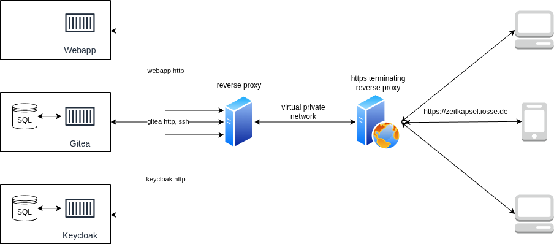
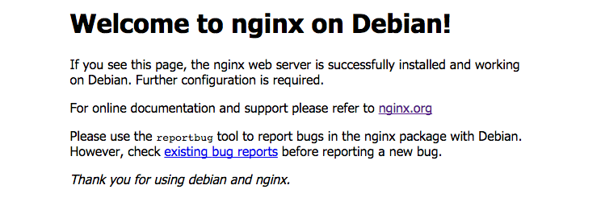
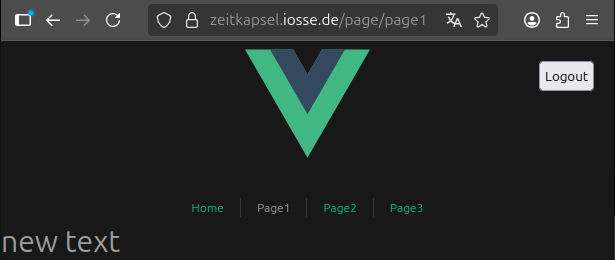
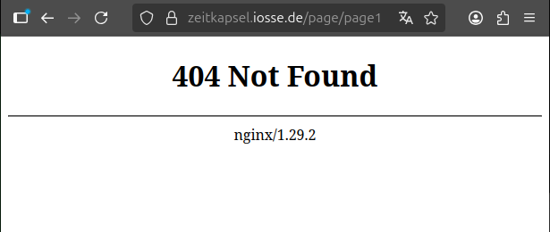
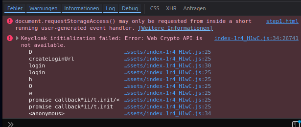
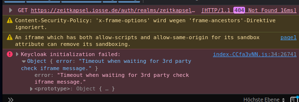
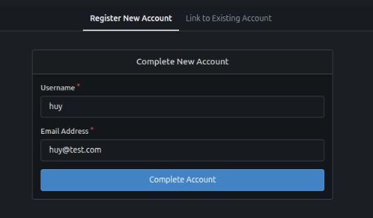
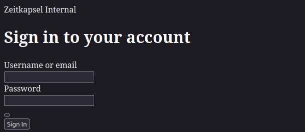

# Zeitkapsel Project Documentation (Out of Date :D)

## 1. Overview

The **Zeitkapsel Project** is designed around a modular, containerized architecture that uses an **Nginx-based reverse proxy** to securely route HTTPS and SSH traffic to multiple backend services within a private network.  

Each service is isolated through containers to ensure scalability, maintainability, and simplified deployment.  

The reverse proxy provides a unified public access point — **zeitkapsel.iosse.de** — for both web and SSH connectivity, handling SSL termination and forwarding essential client headers to backend services.

---

## 2. Architecture



### - HTTPS Terminating Reverse Proxy
- Serves as the public entry point for all external traffic.  
- Terminates HTTPS (TLS) connections using Let’s Encrypt certificates.  
- Forwards requests to the internal reverse proxy within the private network.  
- Handles both HTTPS (application) and SSH (Git) protocols securely.

### - Internal Reverse Proxy
- Acts as a unified routing layer for internal services.  
- Distributes incoming requests based on URL paths and ports to appropriate backend containers.  
- Simplifies service management and supports future scalability.

### - Backend Services
- **Web App (Vue.js)** — served via Nginx behind the internal proxy.  
- **Keycloak** — provides centralized authentication and identity management, accessible under `/auth/`.  
- **Gitea** — offers Git repository hosting and a web-based interface under `/git/`.  
  - SSH access for Git operations is handled through the Nginx stream module and routed to Gitea.

The decision to setup a **reverse proxy behind another reverse proxy** rather than a **single reverse proxy** for both **HTTPS terminating** and **distributing incoming requests** come from the fact that Let’s Encrypt certificate (`https://zeitkapsel.iosse.de`) is being managed by a server that connected to a separate network. Hence, an **internal reverse proxy** is necessary to simplify the connection.

---

## 3. Getting Started

### Network Setup
Before starting any containers, create a dedicated Podman network:
```bash
podman network create zeitkapsel-net
```

### Starting Containers
To ensure proper operation, start services in sequence — with the zeitkapsel-proxy last:
```bash
podman-compose -f ~/zeitkapsel/Zeitkapsel-Webapp/podman-compose.yml up -d
podman-compose -f ~/zeitkapsel/Gitea/podman-compose.yml up -d
podman-compose -f ~/zeitkapsel/Zeitkapsel-Server/podman-compose.yml up -d
```

### Stopping Containers
To stop individual services:
```bash
podman-compose -f ~/zeitkapsel/Zeitkapsel-Webapp/podman-compose.yml down
podman-compose -f ~/zeitkapsel/Gitea/podman-compose.yml down
podman-compose -f ~/zeitkapsel/Zeitkapsel-Server/podman-compose.yml down
```

### Restarting Containers

To restart a specific container:

1. Identify its name with:
```bash
podman ps
```
2. Restart using:
```bash
podman restart <container_name>
```

---

## 4. Technical Details

###  Web App
The **Zeitkapsel Web App** currently functions as a **placeholder** frontend designed to validate authentication and routing within the platform’s multi-proxy environment. <br>
It demonstrates secure Keycloak integration and ensures proper HTTPS enforcement through both internal and external reverse proxies.

While it’s built using **Vue.js**, its primary purpose is not user-facing functionality — it serves as a testbed to ensure that:

- The authentication flow via Keycloak works correctly.
- Token-based access and redirects function behind multiple proxies.
- The deployment pipeline (build → Nginx → reverse proxy) operates as intended.

### - Authentication Flow (Keycloak Integration)
Authentication is handled client-side using the official `keycloak-js` adapter

On application startup:
1. The `Keycloak` object is initialized with environment-specific parameters:
```javascript
const keycloak = new Keycloak({
  url: import.meta.env.VITE_KEYCLOAK_URL,   // Base Keycloak URL
  realm: import.meta.env.VITE_KEYCLOAK_REALM, // Realm name
  clientId: import.meta.env.VITE_KEYCLOAK_CLIENT, // Frontend client ID
});
```
2. The app calls:
```javascript
keycloak.init({
  onLoad: 'login-required',
  pkceMethod: 'S256',
})
```
- `onLoad: 'login-required'` forces immediate login when the app loads.
- `pkceMethod: 'S256'` enables secure PKCE-based authentication (Proof Key for Code Exchange).
- Keycloak redirects to the configured realm for login and returns a token via redirect URL.
3. If authentication succeeds, Vue initializes:
```javascript
app.config.globalProperties.$keycloak = keycloak;
app.use(router);
app.mount("#app");
```
- The Keycloak instance is made globally available to all components.

### - Build & Deploy Steps
#### 1. Build Container (`app-build`)
- Based on `node:22`
- Installs dependencies and runs `npm run build`
- Production assets to a shared Podman volume `app-dist`
``` yaml
app-build:
  image: node:22
  working_dir: /app
  volumes:
    - .:/app
    - app-dist:/app/dist
  command: >
    sh -c "npm install && npm run build"
```

#### 2. Runtime Container (`webapp`)
- Based on `nginx:1.29.2`
- Mounts the built static files from the `app-dist` volume
- Uses a minimal Nginx configuration to serve the Vue SPA
``` yaml
webapp:
  image: nginx:1.29.2
  volumes:
    - app-dist:/usr/share/nginx/html:Z
    - ./default.conf:/etc/nginx/conf.d/default.conf:Z
  depends_on:
    - app-build
```

 --- 

###  Gitea
The **Gitea service** provides self-hosted Git repository management for various internal project.<br>
It is deployed as a containerized instance connected to a dedicated PostgreSQL database, and integrated with the global reverse proxy system for **HTTPS and SSH** access.

Access to the Gitea service can be authenticated using two methods: **Internal managed** keycloak account or **HTWK faculty managed** account.

### - Deploy Steps
#### 1. Postgres Container (`postgres-gitea`)
- Based on `postgres:18`
- Initializes a database based on predefined environment variables.
- The database is stored persistently in `postgres-data`
``` yaml
postgres-gitea:
  image: docker.io/library/postgres:18
  container_name: postgres-gitea
  restart: always
  environment:
    POSTGRES_USER: ${USER}
    POSTGRES_PASSWORD: ${PASSWORD}
    POSTGRES_DB: ${NAME}
  volumes:
    - ./postgres-data:/var/lib/postgresql/data 
```

#### 2. Gitea Container (`gitea`)
- Based on `gitea:1.25.0-rc0`
- Exposing SSH port of Gitea through port 2222 of host machine
- Apply various configuration automatically alongside with container initialization
``` yaml
gitea:
  image: docker.io/gitea/gitea:1.25.0-rc0
  container_name: gitea
  restart: always
  ports:
    - "2222:22"
  volumes:
    - ./data:/data:Z
```

#### Core Configuration Highlights
#### - Server Settings
``` yaml
  environment:
    - GITEA__server__DOMAIN=${DOMAIN}                # Public domain
    - GITEA__server__ROOT_URL=${ROOT_URL}            # Public web path
    - GITEA__server__HTTP_PORT=8081                  # Internal HTTP service port
    - GITEA__server__SSH_DOMAIN=${DOMAIN}            # SSH domain
    - GITEA__server__SSH_PORT=22                     # Internal SSH port
    - GITEA__server__DISABLE_SSH=false               # Enable SSH access
```

These ensure that all repository links and clone URLs resolve correctly through the external reverse proxy domain.

#### - Database Settings
``` yaml
    - GITEA__database__DB_TYPE=postgres
    - GITEA__database__HOST=postgres-gitea:5432
    - GITEA__database__NAME=${NAME}
    - GITEA__database__USER=${USER}
    - GITEA__database__PASSWD=${PASSWORD}
```
Establish connection to the `postgres-gitea` database using the same set of predefined environment variables.<br>
The database instance handles all Gitea’s persistent data.

#### - Authentication & Access Control
``` yaml
    - GITEA__openid__ENABLE_OPENID_SIGNIN=false
    - GITEA__openid__ENABLE_OPENID_SIGNUP=false

    - GITEA__service__REGISTER_EMAIL_CONFIRM=false
    - GITEA__service__ENABLE_PASSKEY_AUTHENTICATION=false
    - GITEA__service__ALLOW_ONLY_EXTERNAL_REGISTRATION=true
```
- OpenID sign-in/signup are disabled — Gitea relies on external identity management (Keycloak) for user provisioning.
- Local user creation is restricted to prevent bypassing centralized authentication.

### - Volumes & Persistence
| Host Volume | Container Path | Purpose |
| -------- | ------- | ------- |
| `./data` | `/data` | Gitea repositories, configuration, and logs |
| `./postgres-data` | `/var/lib/postgresql/data` | PostgreSQL persistent database storage |

---

###  Keycloak and Internal Reverse Proxy
The **Keycloak service** provides **centralized authentication, authorization, and identity management** for the Zeitkapsel platform.
It acts as the **OpenID Connect (OIDC)**, integrating seamlessly with applications such as the Webapp and Gitea via the internal proxy network.

Keycloak is deployed as a Podman container connected to a dedicated PostgreSQL database and accessed through an internal Nginx-based reverse proxy (`zeitkapsel-proxy`), which handles routing and connect to HTTPS reverse proxy.

***Keycloak and the internal reverse proxy*** are bundled together in the same `podman-compose` configuration due to their co-dependent nature. Keycloak requires the reverse proxy for external access, while the proxy relies on Keycloak for authentication.

### - Deploy Steps
#### 1. Postgres Container (`postgres-keycloak`)
- Based on `postgres:18`
- Initialize a Database base on a predefinded env variable 
- The database is stored persistently in `postgres-data`
``` yaml
postgres-keycloak:
  image: docker.io/library/postgres:18
  container_name: postgres-keycloak
  restart: always
  environment:
    POSTGRES_USER: ${POSTGRES_USER}
    POSTGRES_PASSWORD: ${POSTGRES_PASSWORD}
    POSTGRES_DB: ${POSTGRES_DB}
  volumes:
    - ./postgres-data:/var/lib/postgresql/data 
```

#### 2. Keycloak Container (`keycloak`)
- Based on `keycloak:26.4.1`
``` yaml
keycloak:
  container_name: keycloak
  image: quay.io/keycloak/keycloak:26.4.1
  restart: always
  command: >
    start 
        --hostname ${KC_HOSTNAME}
        --hostname-admin ${KC_HOSTNAME_ADMIN}
        --proxy-headers xforwarded
        --hostname-strict false
  environment:
    - KC_BOOTSTRAP_ADMIN_USERNAME=${KEYCLOAK_ADMIN}
    - KC_BOOTSTRAP_ADMIN_PASSWORD=${KEYCLOAK_ADMIN_PASSWORD}
    - KC_HTTP_PORT=8082 
    - KC_HTTP_ENABLED=true 

    - KC_DB=postgres
    - KC_DB_URL=jdbc:postgresql://postgres-keycloak:5432/${POSTGRES_DB}
    - KC_DB_USERNAME=${POSTGRES_USER}
    - KC_DB_PASSWORD=${POSTGRES_PASSWORD}
  depends_on:
    - postgres-keycloak
```

#### Core Configuration Highlights
- `--proxy-headers` xforwarded allows Keycloak to correctly interpret client IPs and HTTPS when behind Nginx proxies.
- `--hostname` and `--hostname-admin` ensure consistent redirect URIs under zeitkapsel.iosse.de.
- `--hostname-strict` false prevents Keycloak from rejecting requests when proxied under subpaths or alternate hostnames (useful for reverse proxying).
- `- KC_HTTP_PORT=8082` Sets the internal HTTP interface to run on port 8082.
  
  #### 3. Internal Reverse Proxy (`zeitkapsel-proxy`)
- Based on `nginx:1.29.2`
- Exposing HTTP port of the container through port 8080 of host machine
``` yaml
zeitkapsel-proxy:
  container_name: zeitkapsel-proxy
  image: docker.io/library/nginx:1.29.2
  restart: always
  ports:
    - "8080:80"
  volumes:
    - ./proxy.conf:/etc/nginx/conf.d/default.conf:Z
  depends_on:
    - webapp
    - keycloak
    - gitea
```

### - Reverse Proxy Configuration
#### Server Block
```nginx
server {
  listen 80;
  server_name zeitkapsel.iosse.de;
```
- Listens on port 80 for internal HTTP connections.
- Uses zeitkapsel.iosse.de as the virtual host name, matching the external reverse proxy configuration.
  
#### Forwarded Headers
```nginx
  proxy_set_header Host $host;
  proxy_set_header X-Real-IP $remote_addr;
  proxy_set_header X-Forwarded-For $proxy_add_x_forwarded_for;
  proxy_set_header X-Forwarded-Proto https;
  proxy_set_header X-Forwarded-Host $host;
```
- The backend services see the original client IP and host.
- The https scheme is preserved, even though this proxy runs over plain HTTP internally.

#### Buffer Settings
```nginx
  proxy_buffer_size 32k;
  proxy_buffers 8 32k;
  proxy_busy_buffers_size 64k;
```
- Increases buffer sizes to handle long HTTP headers from Keycloak (especially OIDC authorization headers).

#### Route Definitions
| Path | Target | Description |
| -------- | ------- | ------- |
| `/` | `http://webapp:80` | Routes to the Vue.js front-end container |
| `/auth/` | `http://keycloak:8082` | Routes authentication requests to Keycloak |
| `/git/` | `http://gitea:8081` | Routes to Gitea container |

---

## 4. Pitfall and Lesson

### Webapp

Building and serving a web application using modern frameworks like Vue.js, Svelte, or Next.js is relatively straightforward — but several common mistakes can occur during deployment.

#### 1. Missing Volume Mapping
After building and testing your project locally, you deploy it to a container — but instead of your app, Nginx shows the default welcome page:



This means the Nginx container is running, but it isn’t serving your built files.
Most likely, you forgot to mount your project directory into the container.

You can fix this by setting the container’s working directory and mapping your project path to it:

``` yaml
working_dir: /app  # Tell Podman where to mount the project
volumes:
  - .:/app         # Map the local project to /app inside the container
  - app-dist:/app/dist
command: >
  sh -c "npm install && npm run build"
```
This ensures your project files are correctly copied and served by Nginx.

#### 2. 404 Not Found Error
Now your page is up and running — navigation works fine until you try to access a route directly via URL:



But refreshing the page or visiting a route manually results in a 404 Not Found:



This happens because Nginx is handling routing instead of Vue.
From Nginx’s perspective, /page/page1 doesn’t exist as a physical file — it’s a virtual route managed by Vue Router.

You can solve this by adding a try_files rule to your Nginx configuration:

```nginx
	try_files $uri $uri/ /page/index.html; 
```
This tells Nginx to fallback to index.html for unknown paths, allowing Vue Router to handle client-side navigation.

https://serverfault.com/a/329970

### 3. Keycloak initialization falied
Once your page is working, you might integrate authentication using Keycloak.
However, after configuring the client, you may encounter this blank page and error message:



This means the client is running in an insecure HTTP session and cannot access browser storage or other secure APIs.

To solve this, run the webapp over HTTPS with a valid certificate, or place it behind a reverse proxy that terminates HTTPS connections.

#### 4. Wrong endpoint detail.

If you see an error like this:


 
It usually means one of the Keycloak configuration variables is incorrect:

```javascript
  url: import.meta.env.VITE_KEYCLOAK_URL,
  realm: import.meta.env.VITE_KEYCLOAK_REALM,
  clientId: import.meta.env.VITE_KEYCLOAK_CLIENT,
```

Make sure the values match your Keycloak configuration:

- url → the URL where Keycloak is hosted
- realm → the realm name used for your app
- clientId → the client registered within that realm

You can verify these in the Keycloak Admin Console → Clients → [Your App] → Settings.

### Gitea

True to its slogan “A painless, self-hosted Git service”, Gitea is straightforward to set up — though not without a few quirks.

#### 1. 500 Internal Server Error
In a development environment where containers are frequently stopped and restarted, you might encounter an unexpected error.

After a user completes their setup and the server shuts down, Gitea’s session store becomes corrupted.



Upon restarting Gitea, you’ll see a **500 Internal Server Error**:

You can confirm this by checking the logs:
```bash
podman logs gitea | grep -i E "panic|error|models/user|routers/user" | tail -n 50
```
```pgsql
err=session(start): gob: name not registered for interface: "code.gitea.io/gitea/routers/web/auth.LinkAccountData" 2025/10/27 14:40:38 routers/common/errpage.go:25:RenderPanicErrorPage() [E] PANIC: session(start): gob: name not registered for interface:
```

This happens because Gitea’s session store (serialized using Go’s gob encoder) contains outdated data referencing old internal structs.
When Gitea restarts, it fails to deserialize these sessions, causing a panic.

The solution for that is to remove all Gitea old cache data with
```bash
podman exec -it gitea bash
rm -rf /data/gitea/sessions/*
rm -rf /data/gitea/tmp/*
rm -rf /data/gitea/indexers/*
```

#### 2. SSH Access Behind a Reverse Proxy
SSH access is a crucial part of any version control system — and Gitea is no exception.
However, getting SSH to work behind a reverse proxy on the same hostname requires some additional configuration.

Add the following environment variables to your gitea service:

```yaml
      - GITEA__server__DOMAIN=${DOMAIN}
      - GITEA__server__HTTP_PORT=8081
      - GITEA__server__ROOT_URL=${ROOT_URL}
      - GITEA__server__SSH_DOMAIN=${DOMAIN}
      - GITEA__server__SSH_PORT=22
```
Expose the SSH port:
```yaml
    ports:
      - "2222:22"  
```
Make sure the SSH and web domains match your actual hostname.

In your HTTPS-terminating Nginx configuration, add a TCP stream block:

`nginx.conf`
```nginx
stream {
    include /etc/nginx/stream.conf;
}

http {
    include       /etc/nginx/mime.types;
    default_type  application/octet-stream;
```
Then, in `stream.conf`, configure a stream for SSH:

```nginx
upstream gitea_ssh {
    server 192.168.106.100:2222;
}

server {
    listen 2222;                 # Public SSH port on proxy
    proxy_pass gitea_ssh;
}
```

Finally, update your `podman-compose.yml` to mount all configurations:
```yaml
volumes:
  - ./proxy.conf:/etc/nginx/conf.d/default.conf:Z
  - ./stream.conf:/etc/nginx/stream.conf:Z
  - ./nginx.conf:/etc/nginx/nginx.conf:Z
```

This creates a direct TCP stream from the reverse proxy to the host machine at port 2222, which maps to the Gitea container — enabling SSH operations (clone, push, pull) over the same domain.

### Keycloak
Keycloak is a stable, feature-rich identity provider with extensive documentation, making setup straightforward.

#### 1. Moving Keycloak to a subpath
When hosting an authentication service, you may need to serve Keycloak under a subpath (e.g., `/auth/`) — either because a subdomain isn’t available or the root path is reserved for another app.

Many older guides use the deprecated Hostname v1 options, which trigger warnings like:
```
WARNING: Hostname v1 options [hostname-path, proxy] are still in use, please review your configuration is it better to use hostname v2
```
…and can even break Keycloak’s UI layout and scripts:



The correct way is to follow hostname v2 format 
```yaml
  command: >
    start 
        --hostname ${KC_HOSTNAME}
        --hostname-admin ${KC_HOSTNAME_ADMIN}
        --proxy-headers xforwarded
        --hostname-strict false
```
This ensures Keycloak handles reverse-proxied subpaths correctly without breaking redirects or static resources.
https://www.keycloak.org/server/hostname